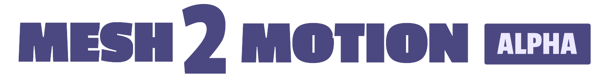
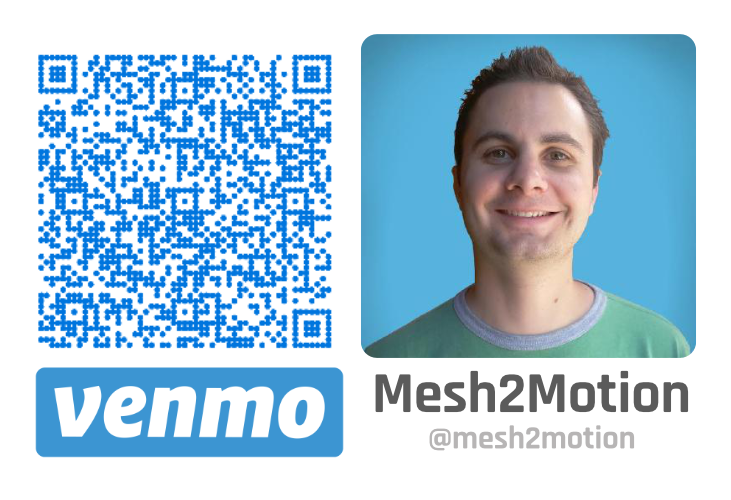

# Mesh2Motion



Mesh2Motion is an open-source web application that allows you to import a 3D model and automatically assign and export animations. It's designed to be a flexible alternative to tools like Mixamo, with support for various model and skeleton types.

**Live Demo:** https://app.mesh2motion.org/
**Marketing & Release Notes:** https://mesh2motion.org/


## Table of Contents

- [Features](#features)
- [Usage](#usage)
- [Getting Started](#getting-started)
  - [Prerequisites](#prerequisites)
  - [Installation](#installation)
  - [Running the Development Server](#running-the-development-server)
- [Building for Production](#building-for-production)
- [Running with Docker](#running-with-docker)
- [Animator Guide](#animator-guide)
- [Contributing](#contributing)
- [License](#license)

## Features

- Import 3D models (GLB/GLTF format).
- Assign various skeleton types to your model.
- Modify the skeleton to fit your model perfectly.
- Preview animations in real-time.
- Select and export animations (GLB/GLTF format).

## Usage

1.  **Import Model:** Start by importing your 3D model in GLB or GLTF format.
2.  **Select Skeleton:** Choose a skeleton type that best fits your model.
3.  **Adjust Skeleton:** Modify the skeleton's position and scale to align with your model.
4.  **Test Animations:** Browse and test various animations on your model.
5.  **Export:** Select the animations you want and export them with your model.

## Getting Started

### Prerequisites

-   [Node.js](https://nodejs.org/) (v22.18.0 or higher)
-   [npm](https://www.npmjs.com/) (usually comes with Node.js)

### Installation

Clone the repository and install the dependencies:

```bash
git clone https://github.com/your-username/mesh2motion.git
cd mesh2motion
npm install
```

### Running the Development Server

To start the development server, run the following command:

```bash
npm run dev
```

This will start a local server, and you can access the application at `http://localhost:5173` (or another port if 5173 is in use). Note that the source code for the application is not included in this repository.

## Building for Production

To create a production-ready build of the application, run:

```bash
npm run build
```

This will generate a `dist` directory with all the necessary files for deployment.

## Running with Docker

If you prefer to use Docker, you can build and run the project with Docker Compose.

1.  Make sure you have [Docker](https://www.docker.com/) and [Docker Compose](https://docs.docker.com/compose/) installed and running.
2.  Run the following command in the project's root directory:

```bash
docker-compose up -d
```

You can then access the application at `http://localhost:3000`.

## Animator Guide

We're always looking for animators to help expand our animation library! If you're an animator, you can find the source Blender files in the `static/blender` directory.

-   `fox.blend`: Animations for the quadruped character.
-   `human.blend`: Animations for the humanoid character.
-   `bird.blend`: Animations for the bird character.

When you've created new animations, please export them to GLB format and place them in the `static/animation` directory, overwriting the existing file. If you have any questions, please reach out!

## Contributing

We welcome contributions from the community! If you'd like to contribute, please fork the repository and create a pull request. We also have an animation fund to hire professional animators.



## License

This project is licensed under the [MIT License](LICENSE).